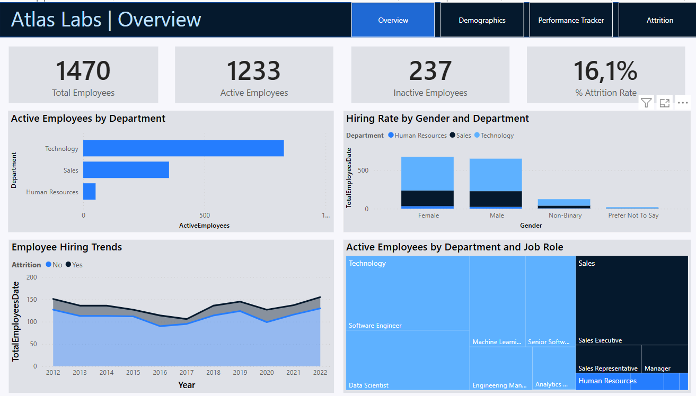
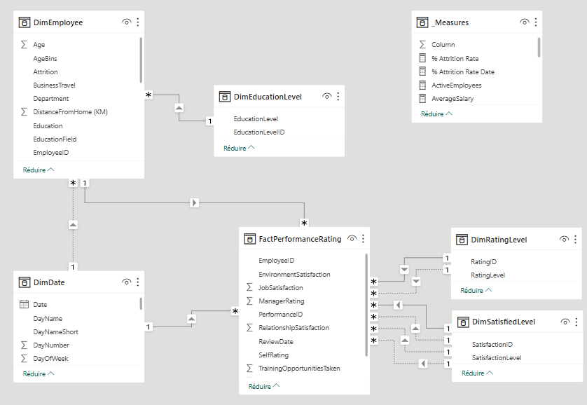

# 📊 HR Analytics Case Study – DataCamp
This project is based on the [HR Analytics in Power BI](https://app.datacamp.com/learn/courses/case-study-hr-analytics-in-power-bi) case study from DataCamp. This project focuses on applying Power BI skills like Data modeling, Data transformation, and Report design to address a real-world problem which is to monitor key HR metrics and understand the factors influencing employee attrition.

## 📂 Dataset and Data Modeling
For this case study, we adopt the Kimball modeling approach, including a Fact table storing yearly employee reviews and multiple dimension tables to provide contextual information. The data model adheres to a snowflake schema. We initiate by loading and preparing our dataset in Power BI, ensuring data cleanliness and appropriate table naming conventions (Fact or Dim). 

- Fact Table: Stores yearly employee performance reviews, including satisfaction ratings and review dates.
- Dimension Tables: Provide contextual information such as employee demographics, education level, satisfaction levels, and rating levels

## 📈 Visualizations & Insights
The report contains 4 pages: 
- **Overview Dashboard:** Presents high-level HR metrics, including total employees, active/inactive status, and attrition rates.

- **Demographics Analysis:** Visualizes employee distribution by age, department, ethnicity, and other factors.

- **Performance Tracker:** Explores trends and drivers of employee turnover.

- **Overview Dashboard:** Performance Tracker: Monitors employee performance and satisfaction over time.

## 🧠 Skills Applied:
- Data import and cleaning
- Data modeling (snowflake schema, relationships)
- Advanced DAX calculations (e.g., USERELATIONSHIP)
- Data visualization and dashboard design
- Business insight generation

## 🚫 Disclaimer

This project is based on educational data provided by DataCamp and does not reflect real-world employee records. It is intended solely for learning purposes.
